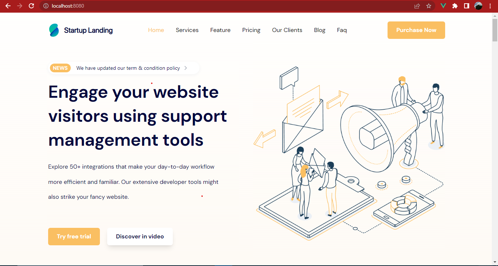

# Vue Mentorship Month 2 Task - To clone a Start Up Landing Page

The [Start Up Landing Page I cloned](https://startup-support-system.vercel.app/).

## Table of contents

- [Overview](#overview)
  - [The challenge](#the-challenge)
  - [Screenshot](#screenshot)
  - [Links](#links)
- [My process](#my-process)
  - [Built with](#built-with)
  - [What I learned](#what-i-learned)
  - [Continued development](#continued-development)
  - [Useful resources](#useful-resources)
- [Author](#author)
- [Acknowledgments](#acknowledgments)

## Overview

### The challenge

To create a pixel perfect clone of [this](https://startup-support-system.vercel.app/) landing page

### Screenshot

### Links

- Solution URL: [GitHub](https://github.com/mikechibuzor/startup-landing-page)
- Live Site URL: [Live Site](https://startup-landingage-vm.netlify.app)

## My process

Approached building this project with the Agile Methodology

### Built with

- Semantic HTML5 markup
- CSS custom properties
- Flexbox
- CSS Grid
- Desktop-first workflow
- [Vue](https://vuejs.org) - JS Framework
- [TailwindCss](https://tailwindcss.com) - Css Framework For Styles

### What I learnt

- How to make the nav-links on a navbar active

## Author

- GitHub - [Chibuzor](https://github.com/mikechibuzor)

## Acknowledgments

- Odetola Kehinde: The Mentor we want to be like

- and the OGs in Vuejs-Golang Mentorship program in Segsalerty Resources
